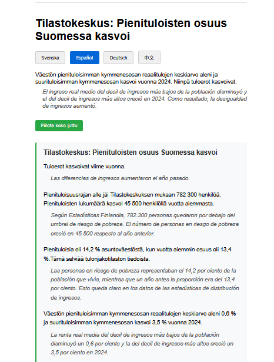

# Finnish News Tools

Tools for Web scraping and translation with multiple languages for Finnish news site YLE.
Saved data has similar rights like it would be saved data from a web browser: personal use only.

Translate news articles and switch between languages instantly in the browser. 
See the same article in several languages to help language learning.

## Quick Start

1. Setup virtual environment:
       python3 -m venv venv
       source venv/bin/activate  # Linux/Mac/WSL
       pip install -r requirements.txt
       playwright install chromium

2. Run scripts:
       python scraper/scraper1.py [search_text]
       python translator/translate_news.py

## Project Structure

- `scraper/` - Web scraping tools for YLE news
- `translator/` - Multi-language translation tool
- `venv/` - Single virtual environment for all modules (gitignored)
- `requirements.txt` - Combined dependencies

# Development by AI

Warning, if you use this project note that AI agents created most of the code.
Human effort was mostly prompt engineering with very little reviews or fixes.

